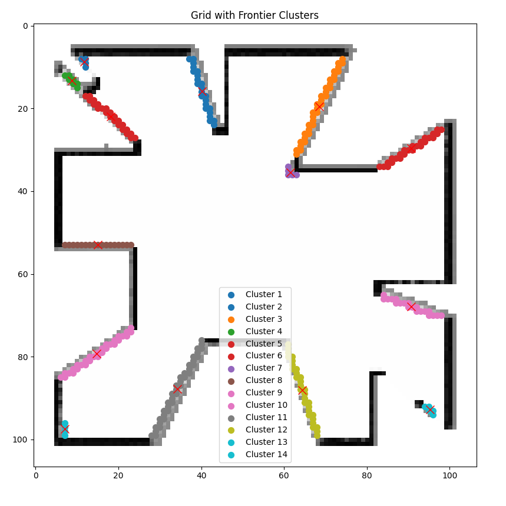

# Implementation of Global Planner (RRT), Local Planner (DWA), and Frontier-Based Exploration for TurtleBot3 in Gazebo Simulation


<div style="margin-top: 30px;"></div>

# Setup Turtlebot3

Install from repository

```
sudo apt install ros-humble-turtlebot3
sudo apt install ros-humble-turtlebot3-simulation
```
Setup the turtlebot3 environement

```
echo "export TURTLEBOT3_MODEL=waffle" >> ~/.bashrc
```

Clone the repo and build the project

```
git clone https://github.com/SyedMazhar6746/Lidar-Based-Exploration-and-Navigation-with-Cartographer-SLAM.git
```

Change the rviz path in the turtlebot3_cartographer using sudo

```
cd ~/opt/ros/humble/share/turtlebot3_cartographer/launch

- open cartographer.launch.py
- Change "rviz_config_dir" to robot_nav/config/cartographer.rviz
```
<div style="margin-top: 50px;"></div>

# Testing the Simulation and Implemented Algorithms

1. Launch the simulation and cartographer to build the map simultaneously

```
ros2 launch robot_nav robot_with_slam.launch.py
```
2. Use teleop_twist_keyboard to rotate the robot to obtain some free cells in the map. Use the "j" key to rotate 90 degree and "l" back to 0 degree.
```
ros2 run teleop_twist_keyboard teleop_twist_keyboard
```
3. Run the below commands in separate terminal for RRT, DWA and frontier in sequence.

```
ros2 run robot_nav rrt_planner.py           (Activate the RRT Planner)
ros2 run robot_nav dwa_planner.py           (Activate DWA Planner) 
ros2 run robot_nav frontier_exploration.py  (Activate Exploration ALgorithm) 
```

<div style="margin-top: 50px;"></div>


# Results 

### Frontier Exploration: colors are frontier clusters and "X" represent centroids

<div style="text-align:center">
    
</div>

## Please watch the videos with the following google drive link

gdrive link: https://drive.google.com/drive/folders/1t0ciPbX9y-6axIjEtazHC9vUpeolBlTr?usp=sharing
